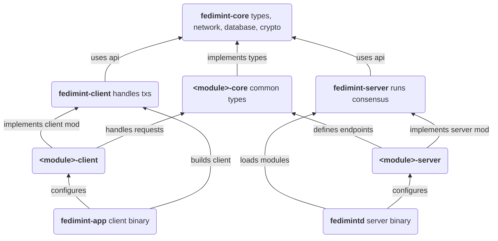

# Fedimint Custom Module Starter Template

> "There are no other rights in substance without the freedom to transact." - Punk6529

[Fedimint](https://github.com/fedimint/fedimint) is a module based system for building federated applications. It is designed to be a trust-minimized, censorship-resistant, and private alternative to centralized applications. This repo is a starter template for building your own custom module for Fedimint, and we're always happy to help if you have any questions.

Fedimint ships with 3 default modules: Bitcoin, Lightning, and Chaumian Ecash, for out-of-the-box best practices for private and trust-minimized payments. A custom module defines further consensus items and transaction types that can leverage these modules to create a federated application.

Please reach out to us on our [Developer Discord](https://discord.gg/cEVEmqCgWG) if you need any help!

## Running the Starter Template

To run the starter template, you'll need to have Nix installed.

```bash
sh <(curl -L https://nixos.org/nix/install) --daemon
```

Then, fork and clone this repo

```bash
git clone https://github.com/your-username/fedimint-custom-modules-example.git
```

and run the following command to start the nix developer environment

```bash
nix develop
```

Then, you can run fedimint with the custom module in mprocs with

```bash
just mprocs
```

## Fedimint General Module Architecture

A fedimint module consists of 3 parts:

1. `fedimint-server` : this contains server side code run by the federation guardians. This is where you define the consensus items, transaction types, and transaction validation rules.
2. `fedimint-client` : this contains client side code run by the client. This is where you define the logic for clients to build, sign, and submit transactions to the federation.
3. `fedimint-common` : this contains common code shared by both the server and client.

### Fedimint Transactions

Fedimint's fundamental structure is the [`Transaction`](https://github.com/fedimint/fedimint/blob/a1f57e3c6ff860a9c4a998bf88ebad73ebdb67c9/fedimint-core/src/transaction.rs#L12), defined as a signed set of inputs and outputs, where the inputs and outputs are defined by the modules. Transactions are submitted to the federation guardians and are only accepted if they are valid according to the consensus rules of the federation (defined by the modules).

- Pegging-In to the fedimint is a Transaction with a Bitcoin input (onchain deposit to the federation) and an Ecash output (mint issuance to the client).
- A lightning payment is an Ecash input (locking ecash and a lightning invoice to a contract) and a Lightning output (proof of payment of the lightning invoice and reissuance of the locked ecash to the gateway who paid the invoice).
- A custom module like the dummy module in this starter template defines its own inputs and outputs. A dummy transaction might define an input of ecash and an output as ecash locked to a public key as the basis of an account system.

Each input and output belongs to a certain module (e.g. Mint, Wallet, Dummy, etc...). All inputs have to add up to the same sum as all outputs. Each input has an associated Schnorr key pair, and the transaction signature is a Musig2 aggregate signature of all the input keys.

```rust
pub struct Transaction {
    pub inputs: Vec<Input>,
    pub outputs: Vec<Output>,
    pub signature: Option<schnorr::Signature>,
}
…
pub enum Input {
    Mint(<fedimint_mint::Mint as FederationModule>::TxInput),
    Wallet(<fedimint_wallet::Wallet as FederationModule>::TxInput),
    LN(<fedimint_ln::LightningModule as FederationModule>::TxInput),
    Dummy(<fedimint_dummy::DummyModule as FederationModule>::TxInput),
}

pub enum Output {
    Mint(<fedimint_mint::Mint as FederationModule>::TxOutput),
    Wallet(<fedimint_wallet::Wallet as FederationModule>::TxOutput),
    LN(<fedimint_ln::LightningModule as FederationModule>::TxOutput),
    Dummy(<fedimint_dummy::DummyModule as FederationModule>::TxOutput),
}
```

## The "Dummy" Module

This starter template creates a "dummy" module that can be used as a starting point for creating your own module. It has extensive comments and documentation to help you get started. The dummy module is a simple module that lets you lock ecash to a public key as an account, unlock ecash with a signature from that public key, and request the federation to sign a message for you.

You can add your module to the default modules by adding it to the `Fedimintd` builder:

```rust
use fedimintd::fedimintd::Fedimintd;

#[tokio::main]
async fn main() -> anyhow::Result<()> {
    Fedimintd::new()?
        .with_default_modules()
        .with_module(fedimint_dummy_server::DummyGen)
        .with_extra_module_inits_params(
            3,
            fedimint_dummy_server::KIND,
            fedimint_dummy_server::DummyGenParams::default(),
        )
        .run()
        .await
}
```

## Dummy Module Architecture

### `fedimint-dummy-client`

The fedimint dummy client implements a state machine to track transactions as the are submitted to and processed by the federation. This is a good pattern to follow for anything you write on the client.

```rust
pub enum DummyStateMachine {
    Input(Amount, TransactionId, OperationId),
    Output(Amount, TransactionId, OperationId),
    InputDone(OperationId),
    OutputDone(Amount, OperationId),
    Refund(OperationId),
}
```

The dummy module's client api has several useful starter methods. You can use these as a starting point for your own module's client api.

```rust
/// Exposed API calls for client apps
#[apply(async_trait_maybe_send!)]
pub trait DummyClientExt {
    /// Request the federation prints money for us
    async fn print_money(&self, amount: Amount) -> anyhow::Result<(OperationId, OutPoint)>;

    /// Send money to another user
    async fn send_money(&self, account: XOnlyPublicKey, amount: Amount)
        -> anyhow::Result<OutPoint>;

    /// Wait to receive money at an outpoint
    async fn receive_money(&self, outpoint: OutPoint) -> anyhow::Result<()>;

    /// Request the federation signs a message for us
    async fn fed_signature(&self, message: &str) -> anyhow::Result<Signature>;

    /// Return our account
    fn account(&self) -> XOnlyPublicKey;

    /// Return the fed's public key
    fn fed_public_key(&self) -> PublicKey;
}
```

### `fedimint-dummy-common`

The fedimint dummy common module defines the types that are shared between the client and server. It's a good place to define the Transaction types, inputs, and outputs for your module.

### `fedimint-dummy-server`

The fedimint dummy server module defines the consensus items and transaction validation rules for the dummy module. The server is divided into two main parts: DummyGen for initialization and non-consensus functions, and Dummy for consensus-related functions and module operations.
It interacts with a database to store and retrieve various types of data related to the dummy module.

- DummyGen (Non-Consensus Functions): Implements the `ServerModuleInit` trait, providing methods for module initialization, database migrations, and configuration generation.
- Dummy (Consensus and Module Operations): Implements the `ServerModule` trait, providing methods for processing consensus proposals, input and output transactions, and auditing. Handles the creation of consensus proposals for signing requests and processes incoming consensus items. Implements input and output processing, including fund transfers and fee calculations.

## Fedimint General ModuleArchitecture

Below is a diagram of the general architecture of a fedimint module and how it interacts with the rest of the fedimint system. Building fedimint modules can be a bit complicated, so again please reach out to us on our [Developer Discord](https://discord.gg/cEVEmqCgWG) if you have any questions. We're always happy to help!


